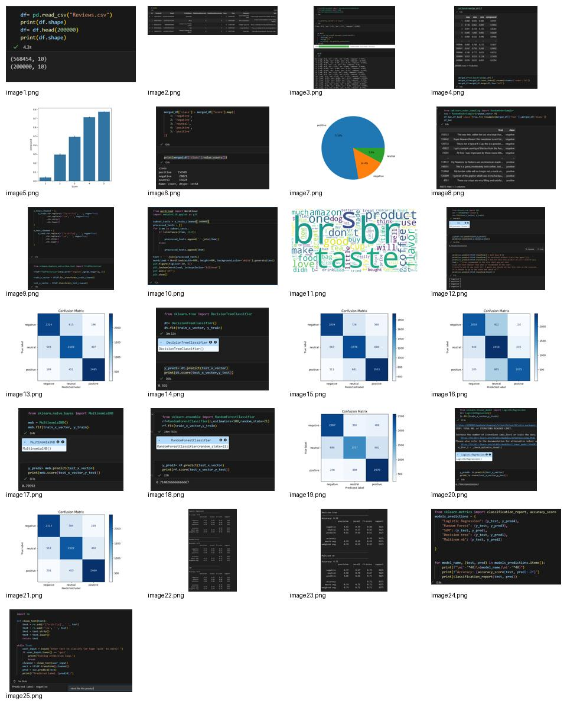
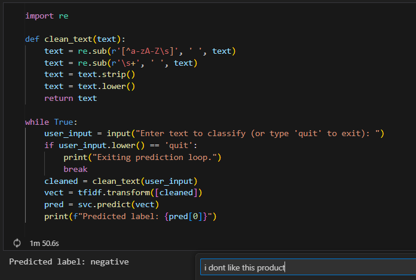

# Amazon Fine Food Reviews Sentiment Classification

An NLP sentiment analysis project that classifies Amazon food reviews into **positive**, **negative**, and **neutral** classes using text preprocessing, TF-IDF feature extraction, and multiple machine learning classifiers.

The project explores Amazon Fine Food Reviews, studies rating imbalance, applies sentiment analysis using VADER for exploration, balances the dataset, trains several text classification models, and provides a simple real-life input review prediction example.

---

## Project Overview

Customer reviews contain valuable feedback about products, but reading thousands of reviews manually is slow and inefficient. This project uses Natural Language Processing and Machine Learning to automatically classify food reviews based on sentiment, helping businesses understand customer opinions faster and at scale.

---

## Dataset

The project uses the **Amazon Fine Food Reviews** dataset.

- File used in the notebook: `Reviews.csv`
- Original size: **568,454 reviews**
- Columns include review text, score/rating, product/user information, helpfulness values, and time metadata
- In this project, the notebook uses a sample of **200,000 reviews** for faster experimentation

> Important: `Reviews.csv` is not included in this repository because it is a large dataset. Download it separately and place it in the project root folder.

---

## Problem Statement

The goal is to classify Amazon food reviews into sentiment categories:

- **Positive**
- **Negative**
- **Neutral**

This can help businesses quickly analyze customer feedback, identify product satisfaction trends, and understand negative or neutral feedback without manually reading all reviews.

---

## Workflow

1. **Data Loading**
   - Read `Reviews.csv`
   - Check dataset shape and columns
   - Use the first 200,000 rows as a working sample

2. **Exploratory Data Analysis**
   - Analyze review scores
   - Study the imbalance in rating distribution
   - Use VADER Sentiment Intensity Analyzer to generate `neg`, `neu`, `pos`, and `compound` sentiment scores

3. **Label Creation**
   - Map review scores into sentiment classes:
     - Scores 1 and 2 → `negative`
     - Score 3 → `neutral`
     - Scores 4 and 5 → `positive`

4. **Data Balancing**
   - The original data is highly imbalanced toward positive reviews
   - Apply `RandomUnderSampler` to balance all sentiment classes equally

5. **Text Preprocessing**
   - Remove special characters
   - Remove extra spaces
   - Convert text to lowercase
   - Apply TF-IDF Vectorizer with English stop-word removal and n-gram features

6. **Model Training**
   - Train multiple classification models:
     - Support Vector Classifier
     - Decision Tree Classifier
     - Multinomial Naive Bayes
     - Random Forest Classifier
     - Logistic Regression

7. **Model Evaluation**
   - Evaluate models using accuracy, confusion matrices, and classification reports
   - Test the final model on custom real-life review inputs

---

## Model Results

| Model | Accuracy |
|---|---:|
| Support Vector Classifier | 74.33% |
| Logistic Regression | 73.64% |
| Random Forest | 71.40% |
| Multinomial Naive Bayes | 70.59% |
| Decision Tree | 59.20% |

The **Support Vector Classifier** achieved the best accuracy in this experiment.

---

## Screenshots

### project outputs

### Input Review Demo


---

## Repository Structure

```text
Amazon-Fine-Food-Reviews-Sentiment-Classification/
│
├── README.md
├── TextClass.ipynb
├── requirements.txt
├── .gitignore
│
├── assets/
│   ├── dataset-preview.png
│   ├── class-distribution-before-balancing.png
│   ├── wordcloud-after-preprocessing.png
│   ├── svc-confusion-matrix.png
│   ├── logistic-regression-confusion-matrix.png
│   └── input-review-demo.png
│
└── Reviews.csv        # Not uploaded to GitHub; download separately
```

---

## How to Run

### 1. Clone the repository

```bash
git clone https://github.com/your-username/your-repository-name.git
cd your-repository-name
```

### 2. Create a virtual environment

```bash
python -m venv venv
```

### 3. Activate the virtual environment

For Windows:

```bash
venv\Scripts\activate
```

For macOS/Linux:

```bash
source venv/bin/activate
```

### 4. Install dependencies

```bash
pip install -r requirements.txt
```

### 5. Download the dataset

Download the Amazon Fine Food Reviews dataset and place the file in the project root folder as:

```text
Reviews.csv
```

The notebook currently reads the dataset using:

```python
df = pd.read_csv("Reviews.csv")
```

So the CSV file must be in the same folder as the notebook unless you change the path.

### 6. Run the notebook

```bash
jupyter notebook TextClass.ipynb
```

Then run the notebook cells from top to bottom.

---

## Technologies Used

- Python
- Pandas
- NumPy
- NLTK VADER
- Scikit-learn
- Imbalanced-learn
- TF-IDF Vectorizer
- Matplotlib
- Seaborn
- WordCloud
- Jupyter Notebook

---

## Notes

- VADER is used for sentiment exploration and analysis.
- The final ML classification pipeline uses review text after preprocessing and TF-IDF vectorization.
- The dataset is strongly imbalanced, so undersampling is used before training.
- The notebook imports `transformers`, but the main implemented classification models are traditional machine learning models using TF-IDF features.

---

## Future Improvements

- Save the best model using `joblib` or `pickle`
- Build a simple Streamlit web app for live review classification
- Try deep learning models such as LSTM or BERT
- Improve preprocessing by removing HTML tags and duplicate reviews
- Tune hyperparameters using GridSearchCV
- Compare results before and after balancing

---

## Project Description

**NLP sentiment analysis project that classifies Amazon food reviews into positive, negative, and neutral using TF-IDF, VADER, and machine learning classifiers.**
